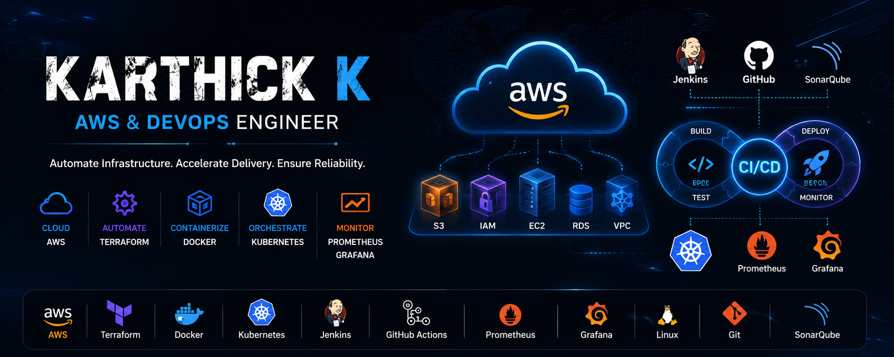

<p align="center">
  
</p>

<div align="center">

# 👋 Hi, I'm Karthick

### AWS & DevOps Engineer | Infrastructure Automation Enthusiast

<p align="center">
Building scalable cloud infrastructure, automating deployments,
and improving reliability through DevOps practices.
</p>


<p align="center">

</p>

</div>

---

## 💼 Professional Summary

I am an aspiring AWS & DevOps Engineer with hands-on experience in designing cloud infrastructure, automating deployments, implementing CI/CD pipelines, and monitoring production workloads.

I enjoy solving operational challenges through automation and continuously improving reliability, scalability, and observability.

---

## 🛠️ Technology Stack

| Category | Technologies |
|-----------|--------------|
| ☁️ Cloud | AWS (EC2, VPC, IAM, S3, Route 53) |
| ⚙️ Infrastructure as Code | Terraform |
| 🐳 Containers | Docker |
| ☸️ Orchestration | Kubernetes |
| 🔄 CI/CD | Jenkins, GitHub Actions |
| 📊 Monitoring | Prometheus, Grafana |
| 🔍 Code Quality | SonarQube |
| 🌿 Version Control | Git, GitHub |
| 🐧 Operating Systems | Linux (Ubuntu) |

---

## 🚀 Featured Projects

| Project | Description |
|----------|-------------|
| ☁️ Terraform AWS Infrastructure | Automated VPC, EC2, S3, Security Groups using Terraform |
| 🔄 Zero-Downtime CI/CD Pipeline | Jenkins + Docker + Kubernetes + SonarQube |
| 📊 Monitoring Stack | Prometheus & Grafana dashboards with alerting |
| ☸️ Kubernetes Administration | Deployments, Services, Namespaces, Scaling |
| 🐳 Docker Projects | Containerized applications and Docker Compose |
| 📚 DevOps Interview Prep | Notes, commands, and interview preparation |

---

## 📈 GitHub Analytics

<p align="center">


</p>

<p align="center">


</p>

---

## 🎯 Current Focus

- 🚀 Advanced Kubernetes
- 🚀 Helm Charts
- 🚀 GitOps with Argo CD
- 🚀 Production Monitoring
- 🚀 AWS Architecture Best Practices

---

## 🧭 DevOps Journey

```text
Linux
  ↓
Git & GitHub
  ↓
AWS
  ↓
Terraform
  ↓
Docker
  ↓
Jenkins
  ↓
SonarQube
  ↓
Kubernetes
  ↓
Prometheus
  ↓
Grafana
```

---

## 🏆 Achievements

- ✅ Built real-world DevOps projects on AWS
- ✅ Implemented Infrastructure as Code using Terraform
- ✅ Automated CI/CD pipelines using Jenkins
- ✅ Deployed applications on Kubernetes
- ✅ Created monitoring dashboards using Grafana

---

## 🤝 Let's Connect

<p align="center">

<a href="https://www.linkedin.com/in/karthick-k-aws-devops/">
  
</a>

<a href="https://github.com/Karthick883">
  
</a>

</p>

---

<div align="center">

### ⭐ Automating Infrastructure • Accelerating Delivery • Ensuring Reliability ⭐

</div>


<!--
**Karthick883/Karthick883** is a ✨ _special_ ✨ repository because its `README.md` (this file) appears on your GitHub profile.

Here are some ideas to get you started:

- 🔭 I’m currently working on ...
- 🌱 I’m currently learning ...
- 👯 I’m looking to collaborate on ...
- 🤔 I’m looking for help with ...
- 💬 Ask me about ...
- 📫 How to reach me: ...
- 😄 Pronouns: ...
- ⚡ Fun fact: ...
-->
